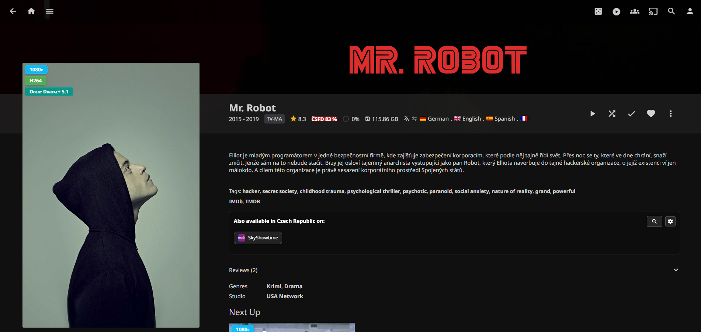
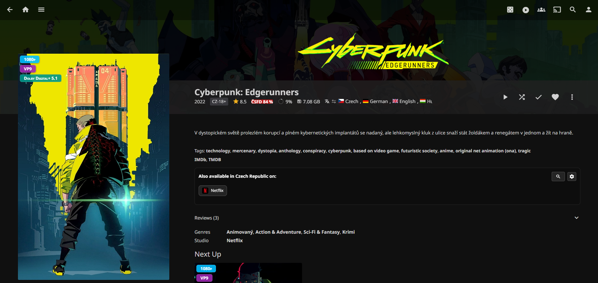
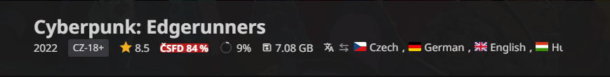

# ČSFD Badge for Jellyfin

An unofficial Jellyfin plugin that adds a cached, clickable ČSFD rating to
movie and series detail pages.

The badge appears next to Jellyfin's existing community and critic ratings.
Clicking it opens the matching title on ČSFD. In the official mobile client,
the URL is handed to the operating system so the ČSFD app can handle it when
installed, with the default browser as fallback.

> [!IMPORTANT]
> This is an independent, unofficial project. It is not affiliated with,
> endorsed by, or supported by ČSFD, POMO Media Group, or the Jellyfin project.

## Screenshots

### Series details





### Rating badge



## Features

- Automatic movie and series matching by title, original title, type, and year
- Clickable `ČSFD 89 %` badge in Jellyfin Web and official mobile clients
- Local positive and negative result cache
- Global request throttling and stale-cache fallback
- Conservative matching threshold to avoid incorrect links
- Administrator-controlled manual matching for exceptional titles
- Authenticated Jellyfin API endpoint
- Configurable scraper URL, cache duration, delay, and match threshold

## Compatibility

- Tested with Jellyfin Server and Web `10.11.11`
- Jellyfin Web and official Android/iOS clients based on Jellyfin Web
- .NET 9

Native clients such as Android TV, Kodi, Roku, and Swiftfin do not load the web
component and are currently unsupported.

## Architecture

```text
Jellyfin Web / Mobile
        │ authenticated request
        ▼
Jellyfin.Plugin.CsfdBadge ── local cache
        │ internal HTTP
        ▼
node-csfd-api container
        │ rate-limited scraping
        ▼
      ČSFD.cz
```

The plugin does not contain a ČSFD scraper. It uses the separate, MIT-licensed
[`bartholomej/node-csfd-api`](https://github.com/bartholomej/node-csfd-api)
REST service.

## Requirements

1. Jellyfin 10.11.x
2. [`node-csfd-api`](https://github.com/bartholomej/node-csfd-api) REST service
3. [JavaScript Injector](https://github.com/n00bcodr/Jellyfin-JavaScript-Injector)
4. File Transformation is recommended for non-destructive web injection

## Installation

### 1. Run node-csfd-api

The example Compose file is in [`deploy/compose.yaml`](deploy/compose.yaml):

```bash
docker compose -f deploy/compose.yaml up -d
```

Keep port `3030` private to your LAN. Do not expose the scraper through a
public reverse proxy or router port forwarding.

### 2. Install JavaScript Injector

Add the repository matching Jellyfin 10.11 in
**Dashboard → Plugins → Repositories**:

```text
https://raw.githubusercontent.com/n00bcodr/jellyfin-plugins/main/10.11/manifest.json
```

Install **JavaScript Injector** and restart Jellyfin.

### 3. Install ČSFD Badge

Add this repository in **Dashboard → Plugins → Repositories**:

```text
https://raw.githubusercontent.com/WesVoj/jellyfin-plugin-csfd-badge/manifest/manifest.json
```

Install **ČSFD Badge** from the catalog and restart Jellyfin.

For a manual installation, download the latest release ZIP and extract it to a
dedicated directory under the Jellyfin plugins directory. For example:

```text
plugins/Csfd Badge/
```

Open **Dashboard → Plugins → ČSFD Badge** and set the internal scraper URL,
for example:

```text
http://YOUR_SERVER_LAN_IP:3030
```

TrueNAS SCALE-specific instructions are in
[`deploy/TRUENAS.md`](deploy/TRUENAS.md).

## Configuration defaults

| Setting | Default | Purpose |
| --- | ---: | --- |
| Rating cache | 168 hours | Refresh successful matches weekly |
| Negative cache | 24 hours | Retry unmatched titles daily |
| Match threshold | 70 | Reject low-confidence matches |
| Request delay | 1200 ms | Limit load on ČSFD |

The first opening of a title normally performs one search and one detail
request. Later openings use the local cache.

### Manual matching

If automatic matching cannot safely identify a title, open
**Dashboard → Plugins → ČSFD Badge**. Paste the Jellyfin item detail URL and the
matching ČSFD URL into **Manual matching**. An administrator can also clear the
manual match there to restore automatic matching.

## Build

Requires the .NET 9 SDK and PowerShell:

```powershell
./scripts/build.ps1
```

The plugin ZIP and Jellyfin repository manifest are written to `artifacts/`.

## Responsible use

This project retrieves individual ratings for titles in a user's own Jellyfin
library. It is not intended for bulk mirroring, dataset creation, or public API
hosting. Keep caching and request delays enabled and comply with the terms and
technical restrictions of the websites you access.

Automated access can be blocked at any time. Neither this project nor
`node-csfd-api` guarantees continued access to ČSFD.

## Credits and trademarks

- ČSFD data is obtained from [ČSFD.cz](https://www.csfd.cz/).
- Scraping and REST service: [bartholomej/node-csfd-api](https://github.com/bartholomej/node-csfd-api), MIT License.
- Jellyfin, ČSFD, and related names and marks belong to their respective owners.

See [`THIRD_PARTY_NOTICES.md`](THIRD_PARTY_NOTICES.md) for dependency details.

## License

Copyright © 2026 WesVoj and contributors.

This project is licensed under the GNU General Public License v3.0 or later.
See [`LICENSE`](LICENSE).
